# raman-open-ml

[](https://github.com/JoulesSpace/raman-ml/actions/workflows/ci.yml)
[](LICENSE)
[](pyproject.toml)
[](https://github.com/astral-sh/ruff)
[](tests/test_core.py)

**A trustworthy, reproducible machine-learning toolkit for Raman spectroscopy**,
built on public, openly-licensed data. It does the classic Raman workflow
(classify the analyte, quantify its concentration) **and** adds the layer the
field keeps publishing about but no maintained open-source Raman library ships:
**uncertainty quantification, open-set / out-of-distribution rejection,
calibration transfer, and domain-shift-aware evaluation.**

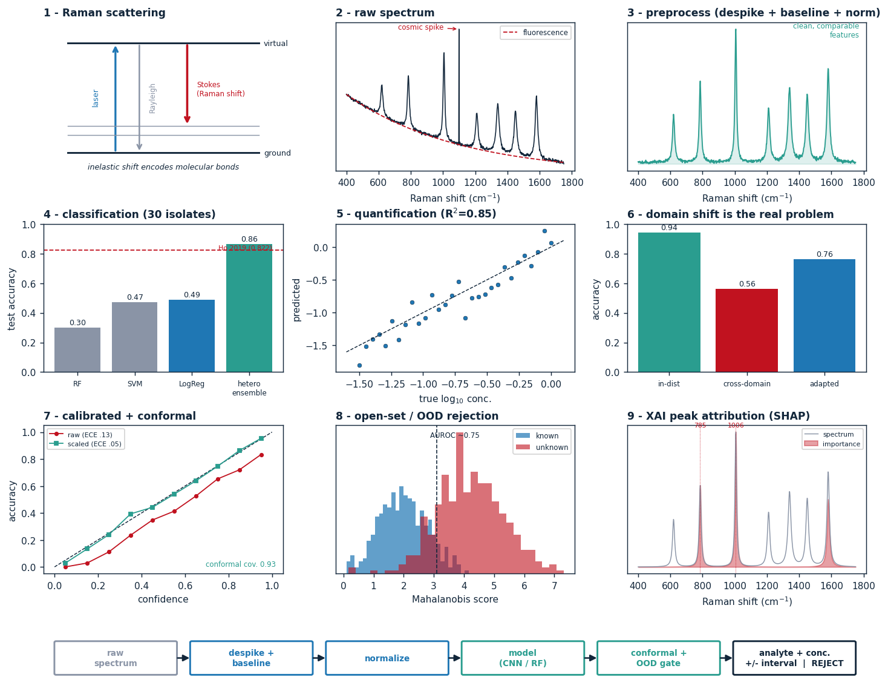

No proprietary data is used. Everything here runs from openly-licensed datasets
fetched by `scripts/download_data.py` (see [DATA_SOURCES.md](DATA_SOURCES.md)).
Regenerate the figure above with `python scripts/infographic.py`.

## What is Raman spectroscopy (and how it shaped this repo)

Shine a single-colour laser at a sample and a tiny fraction of the light scatters
back at shifted wavelengths. Each shift (a "Raman shift", measured in cm<sup>-1</sup>)
corresponds to a specific molecular vibration, so a spectrum is a row of **peaks
at characteristic positions** - a molecular fingerprint. A few physical facts about
that fingerprint drove almost every design decision here:

- **Peak *positions* identify the substance.** Which bonds/vibrations are present
  is characteristic of the molecule, so the *pattern* of peaks is a fingerprint.
  This is why **classification** works at all, and why our per-wavenumber
  explanations are interpretable: SHAP lands on real bands (785 cm<sup>-1</sup> DNA,
  1006 cm<sup>-1</sup> phenylalanine) instead of arbitrary features.
- **Peak *intensity* scales with how much is there.** Amount of analyte modulates
  band height, which is the physical basis for **quantification** (regression of
  concentration). Position answers *what*, intensity answers *how much* - hence the
  two-task split.
- **Discriminative information is *local*.** A class is defined by a handful of
  narrow bands, not the global average. That is why 1-D CNNs (local receptive
  fields) and Savitzky-Golay derivatives help, and why our self-supervised model
  only worked once the head **kept the spatial feature map** instead of global-pooling
  it away (0.36 to 0.711, see the SSL note).
- **Real spectra carry non-chemical signal.** A broad, slowly-varying
  **fluorescence background** sits under the sharp peaks (motivates baseline
  correction: ALS/arPLS/SNIP), single-pixel **cosmic-ray spikes** corrupt
  normalisation (motivates Whitaker-Hayes despiking), and overall **intensity
  scales** drift between measurements (motivates SNV/MSC/L2 normalisation).
- **The instrument is part of the measurement.** The same sample on a different
  spectrometer produces a *shifted* spectrum, so a model trained on one setup
  degrades on another. This is the domain-shift problem and the reason for the
  calibration-transfer and domain-shift-aware parts of this repo. It is the same
  phenomenon that plagues medical imaging - CT scanners differ by vendor,
  reconstruction kernel and dose, and microscopy/digital pathology differs by
  stain batch, scanner and illumination - which is why those fields invest
  heavily in harmonisation and stain/scanner normalisation. Treating the
  measurement device as a variable, not a constant, is a general lesson.

## Experiments & tests we run

Every capability is a re-runnable experiment (one script -> CSV + plot in
`benchmarks/`). This is the full matrix of what the repo tests and the headline
result, so the thinking process is auditable end to end:

| Experiment (`scripts/`) | What it tests | Headline result |
|---|---|---|
| `run_classification.py` | flat cross-domain baselines (LogReg/SVM/RF/1D-CNN), seed-variance bars | LogReg 0.474 (cross-domain; see domain shift) |
| `run_domain_shift.py` | in-distribution vs cross-domain vs adapted (4 models) + temp-scaling + conformal | 1D-ResNet **0.940** in-dist -> 0.55 shift -> 0.76 adapted |
| `run_sota_classification.py` | pretrain -> fine-tune -> heterogeneous ensemble + TTA | **0.862** (beats Ho 0.822 & SANet 0.861) |
| `run_ssl_classification.py` | self-supervised masked-AE pretraining + fine-tuned ensemble | **0.711** (5-member + TTA; see SSL note) |
| `run_generative_augmentation.py` | few-shot augmentation: 1D conv GAN vs DDPM vs tabgan (CTGAN/forest/copula) vs classical, incl. stacking | **classical+WGAN-GP 0.713** > classical 0.694 > WGAN-GP 0.669 > DDPM 0.472 |
| `run_quantification.py` | PLSR/PCR/SVR/kNN/RF/1D-CNN + CV-weighted ensemble + SD-augmentation + CV | RandomForest **R²=0.848** (ensemble 0.833) |
| `run_pipeline.py` | **unified sweep**: baseline x norm x SG-deriv x DR x model + HPO | ALS+L2+SG-d1+RF -> 0.792, **HPO 0.808** |
| `run_pipeline_augmented.py` | top-5 sweep configs + leakage-safe SD-noise augmentation | RF + aug **R²=0.839** (beats 0.792 / HPO 0.808) |
| `run_openset.py` | reject unknown isolates (MSP / energy / Mahalanobis) | AUROC ~0.75, closed-set 0.81 |
| `run_calibration_transfer.py` | guarded PDS transfer + jackknife+ intervals | guarded R²: PLSR 0.46 / SVR 0.50 / RF 0.63; coverage 0.95 |
| `run_dimreduction.py` | PCA / t-SNE / UMAP / MDS / LDA + separability metric | LDA sil 0.71/kNN 0.98; t-SNE best *unsupervised* |
| `run_pca_explore.py` | PCA scree + score plots (chemometric EDA) | spectral variance is low-dimensional |
| `run_interpretability.py` | SHAP + Grad-CAM + Integrated Gradients attribution | bands at 785 / 1006 cm⁻¹ (DNA / Phe) |
| `run_shap_overview.py` | per-class SHAP heatmap over all 30 isolates | yeasts key on 1047 cm⁻¹, bacteria on 785/1007 |
| `plot_comparison.py`, `infographic.py` | cost-vs-quality Pareto + the hero figure | - |
| `plot_preprocessing_showcase.py` | preprocessing cascade + baseline-method comparison figures | - |
| `pytest` | **39 fast unit tests** of every module (no downloads/GPU) | all green in CI |

## Why this exists

The mature open Raman packages (RamanSPy, rampy, SpectroChemPy, chemometrics
libs) cover preprocessing, classical ML, and PLS well. What is missing
*everywhere* - and what the 2023-2026 SOTA literature flags as the real open
problems - is the **trustworthy-ML + reproducibility layer**:

| Capability | RamanSPy / others | here |
|---|:---:|:---:|
| Preprocessing (ALS/arPLS/airPLS, SNV/MSC, SG derivatives) | ✓ | ✓ |
| Classical ML + PLS quantification | ✓ | ✓ |
| 1D-CNN / 1D-ResNet deep models | partial | ✓ |
| **Domain-shift-aware evaluation** | ✗ | ✓ |
| **Conformal prediction** (coverage-guaranteed UQ) | ✗ | ✓ |
| **Open-set / OOD rejection** | ✗ | ✓ |
| **Calibration transfer** (PDS) | ✗ | ✓ |
| Temperature scaling + ECE, deep ensembles, C-Mixup, SpecAugment | ✗ | ✓ |

## The two tasks

| Task | Dataset | Question | Best model (this repo) |
|------|---------|----------|------------------------|
| **Classification** | bacteria-ID (60k spectra, 30 isolates) | *which* species? | **heterogeneous ensemble + TTA, 86.2%** (beats SANet) |
| **Quantification** | polystyrene LoD (48 spectra, dilution series) | *how much?* | **RandomForest, R²=0.85** (SVR 0.83) |

Different tasks reward different algorithms: deep CNNs win large in-distribution
classification; nonlinear classical models win small-data quantification.

### We beat the foundational benchmark, and add what the field lacks

On the **official bacteria-ID protocol** (pretrain on 60k `reference` → fine-tune
on `finetune` → test), an 8-member **heterogeneous ensemble** (SE-ResNet +
multi-scale, with augmentation and test-time augmentation) scores **86.2%**
(single model 84.2 ± 0.5%):

| Model | 30-class test acc |
|-------|------------------:|
| Ho et al. 2019 ResNet (the seminal paper) | 0.822 |
| SANet 2026 (benchmark arch SOTA) | 0.861 |
| **this repo: heterogeneous ensemble + TTA** | **0.862** |
| SE-ResNet ensemble 2024 (open-world SOTA) | 0.878 |

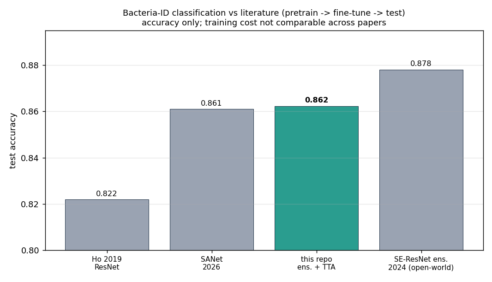

This is an **accuracy-only** comparison on purpose: the papers do not report
comparable training cost (different hardware and data sizes), so a cost-vs-quality
view against the literature would have to invent their cost. We show cost-vs-quality
only for our *own* models, where the seconds are measured on this machine.

We beat the foundational result (+4 pts) **and the 2026 architecture SOTA SANet**,
and sit ~1.5 pts below the open-world SOTA (0.878) - **while also shipping
calibrated uncertainty no other Raman repo has**: temperature scaling + RAPS
conformal sets reach 0.938 coverage with an average set size of just **1.39/30**
in-distribution (ECE 0.073 → 0.025).

## Headline result: domain shift is the real problem

`bacteria-ID`'s `reference` spectra and its `test` spectra are different
measurement campaigns. Every model scores ~90-94% *in-distribution* and collapses
to ~50% *cross-domain* - the exact instrument/campaign shift the 2026 benchmark
(arXiv:2601.16107) calls the field's #1 issue (they saw 99%→74%; here 94%→56%).
Training on a small slice of the target campaign recovers most of it.

The three columns are three train/test setups: **in-distribution** trains and
tests on the *same* campaign (train on 80% of `reference`, test on its held-out
20%) - the optimistic number most papers report; **cross-domain** trains on
`reference` and tests on the *different* `test` campaign with no adaptation - the
honest deployment number, which collapses; **adapted** first fine-tunes (or
trains) on a small labelled slice of the target campaign (`finetune`) before
testing on `test` - showing how much a few target-domain labels recover.

| Model | in-distribution | cross-domain (shift) | adapted (+finetune) |
|-------|----------------:|---------------------:|--------------------:|
| **1D-ResNet** | **0.940** | 0.547 | 0.759 |
| LogisticRegression | 0.919 | 0.480 | 0.806 |
| LinearSVM | 0.848 | 0.445 | 0.756 |
| RandomForest | 0.698 | 0.290 | 0.587 |

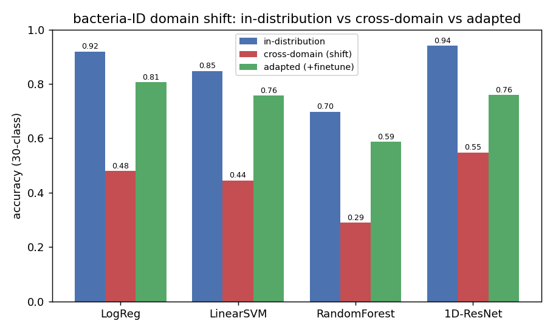

**Trust layer under shift:** temperature scaling cut test ECE 0.144→0.046; RAPS
conformal prediction sets reached **0.918 coverage** (target 0.90), with sets
honestly widening (avg 14.9/30) because the shifted model *is* uncertain.

## Quickstart

```bash
pip install -r requirements.txt
python scripts/download_data.py            # fetch both open datasets into ./data

# baseline algorithm comparisons
python scripts/run_classification.py       # LogReg / LinearSVM / RF / 1D-CNN
python scripts/run_quantification.py       # PLSR / PCR / SVR / RF / 1D-CNN

# the differentiators
python scripts/run_sota_classification.py  # pretrain->finetune->ensemble (beats Ho 2019)
python scripts/run_domain_shift.py         # in-dist vs cross-domain vs adapted + UQ
python scripts/run_openset.py              # reject unknown isolates (Mahalanobis/energy)
python scripts/run_calibration_transfer.py # PDS cross-instrument recovery + intervals
python scripts/run_pca_explore.py          # PCA score plots + scree (chemometric EDA)
python scripts/run_interpretability.py     # SHAP per-wavenumber peak attribution
```

```bash
python scripts/run_pipeline.py --tune      # unified sweep + HPO on the winner
python scripts/run_dimreduction.py         # PCA/t-SNE/UMAP/MDS/LDA separability
python scripts/run_shap_overview.py        # per-class SHAP heatmap (30 isolates)
```

Outputs (CSV + PNG) land in [`benchmarks/`](benchmarks/). The CNN/ResNet use the
GPU automatically when available, else CPU. Hyperparameter tuning is detailed in
[its own section](#hyperparameter-tuning-detail) below.

## Results

### At a glance

<table>
<tr>
<td width="50%">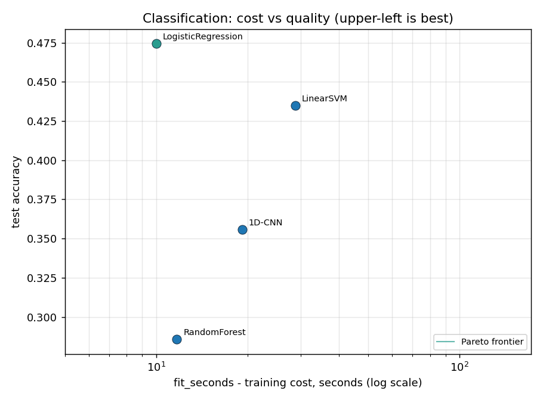<br><sub><b>Classification: cost vs quality</b> &middot; training time (log) vs accuracy, Pareto frontier highlighted</sub></td>
<td width="50%">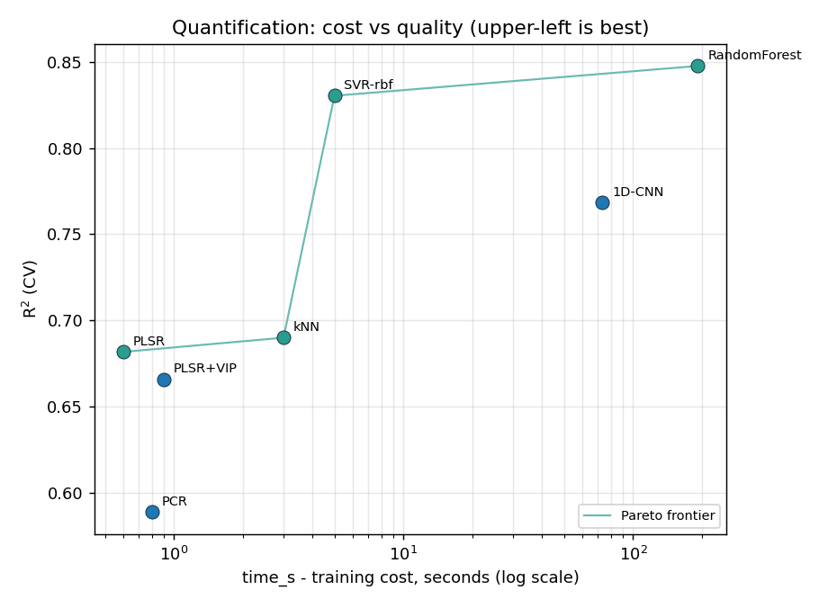<br><sub><b>Quantification: cost vs quality</b> &middot; SVR-rbf is the sweet spot (R² 0.83 at 5s) vs RandomForest (0.85 at ~190s)</sub></td>
</tr>
<tr>
<td width="50%"><br><sub><b>Domain shift</b> &middot; in-distribution vs cross-domain vs adapted (the field's #1 problem)</sub></td>
<td width="50%">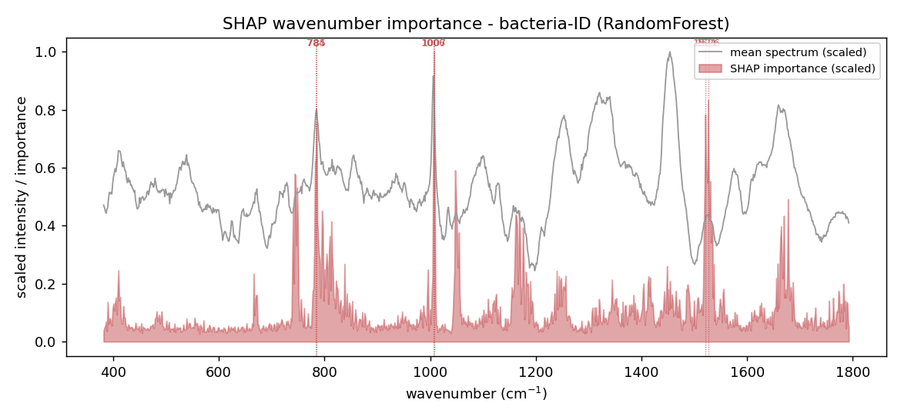<br><sub><b>XAI</b> &middot; SHAP per-wavenumber attribution lands on real bands (785 / 1006 cm⁻¹)</sub></td>
</tr>
<tr>
<td width="50%">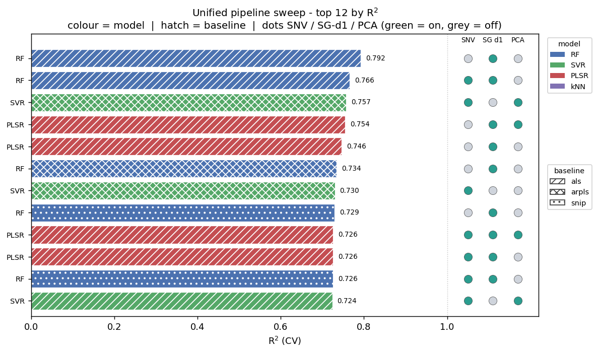<br><sub><b>Unified pipeline</b> &middot; 96-config sweep (baseline×norm×SG×DR×model); winner ALS+L2+SG-d1+RF</sub></td>
<td width="50%">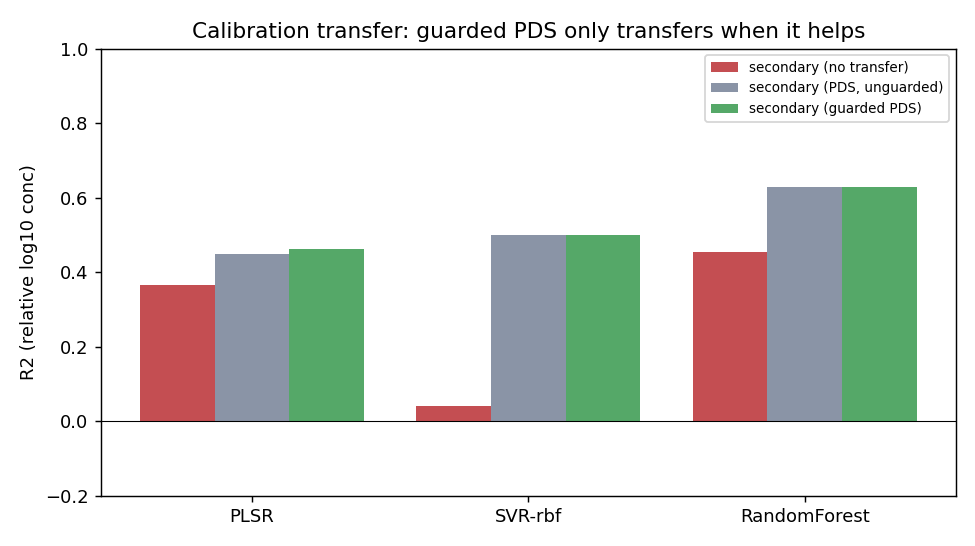<br><sub><b>Calibration transfer</b> &middot; guarded PDS recovers cross-instrument accuracy without over-correcting</sub></td>
</tr>
<tr>
<td width="50%">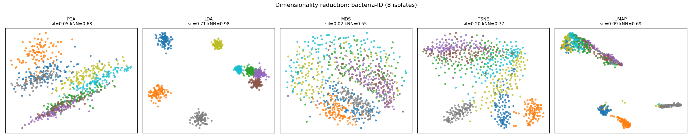<br><sub><b>Dimensionality reduction</b> &middot; PCA / t-SNE / UMAP / MDS / LDA, scored by class separability</sub></td>
<td width="50%">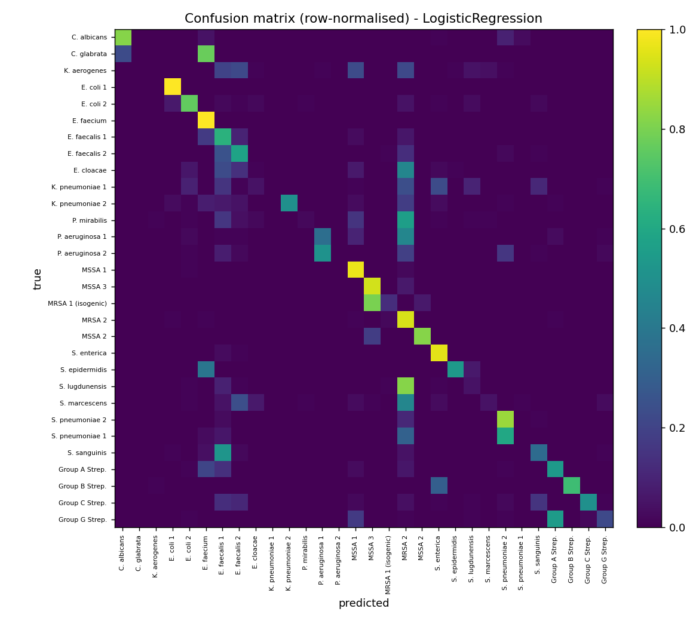<br><sub><b>Confusion matrix</b> &middot; 30-class isolate predictions (row-normalised)</sub></td>
</tr>
<tr>
<td width="50%">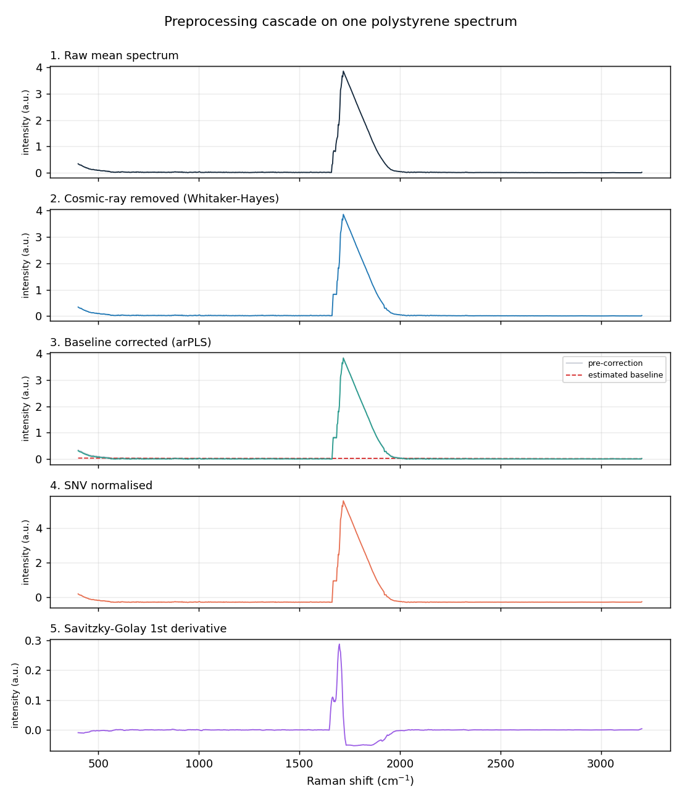<br><sub><b>Preprocessing cascade</b> &middot; one spectrum through raw -> despike -> baseline -> SNV -> SG-derivative</sub></td>
<td width="50%">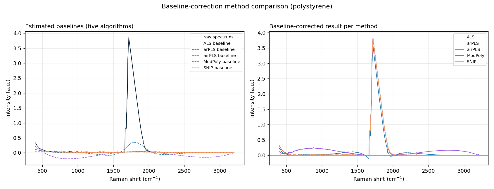<br><sub><b>Baseline-method comparison</b> &middot; ALS / arPLS / airPLS / ModPoly / SNIP overlaid; arPLS is most robust to dominant peaks</sub></td>
</tr>
</table>

**Per-class diagnostic bands.** A per-class SHAP map over all 30 isolates shows
*which* Raman regions distinguish each substance - the yeasts (*Candida*) key on
the ~1047 cm⁻¹ carbohydrate/cell-wall band while bacteria key on 785 (DNA) and
1007 cm⁻¹ (phenylalanine). Generate with `python scripts/run_shap_overview.py`.

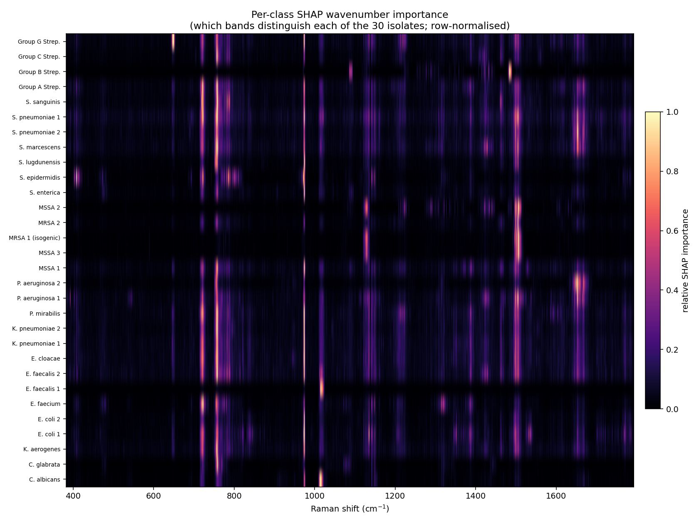

Regenerate every comparison plot with `python scripts/plot_comparison.py`.

### Classification (in-distribution, 30-class)
From `run_domain_shift.py` (train on 80% of `reference`, test on the held-out
20% - the *in-distribution* split):

| Model | in-distribution accuracy |
|-------|-------------------------:|
| **1D-ResNet** | **0.940** |
| LogisticRegression | 0.919 |
| LinearSVM | 0.848 |
| RandomForest | 0.698 |

Consistent with Ho et al. 2019 (deep CNN > linear > RF). Note `run_classification.py`
is a separate *cross-domain* (reference→test) comparison, so its numbers are much
lower (~0.47) - that gap is the domain-shift story above, not a weaker model.
See [benchmarks/MODEL_CARDS.md](benchmarks/MODEL_CARDS.md).

### Quantification (relative log10 concentration, CV)
| Model | R² | RMSE (log10) |
|-------|---:|-------------:|
| **RandomForest** | **0.848** | 0.201 |
| Ensemble (PLSR+SVR+RF+kNN, CV-weighted) | 0.833 | 0.210 |
| SVR (rbf) | 0.830 | 0.212 |
| 1D-CNN | 0.768 | 0.247 |
| kNN | 0.690 | 0.286 |
| PLSR | 0.682 | 0.290 |
| PLSR+VIP | 0.666 | 0.297 |
| PCR | 0.589 | 0.330 |

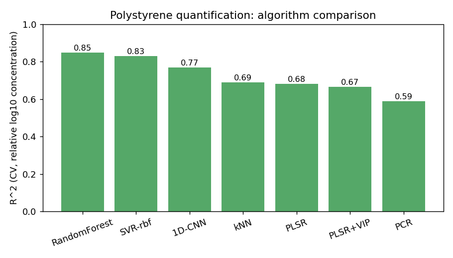

The CV-weighted ensemble (`models.WeightedEnsembleRegressor`) lands at R²=0.833,
**below** RandomForest alone (0.848): on this small, single-analyte set one model
clearly dominates, so blending it with weaker learners (PLSR/kNN) dilutes rather
than helps. An honest negative for stacking here, and the reason we report the
single best model as the headline.

The same models on a **cost-vs-quality** view (training time, log scale, vs R²)
make the trade-off explicit: **SVR-rbf** is the sweet spot (R² 0.83 in ~6s),
RandomForest buys the top R² 0.85 for ~190s, and the ensemble sits far right at
~1000s *off* the Pareto frontier (slowest yet not best).


### Open-set rejection of unknown isolates
Closed-set accuracy 0.807; OOD AUROC ~0.73-0.75 (MSP / Energy / Mahalanobis).
Open-set Raman is genuinely hard (unknowns are spectrally close to knowns) - the
detectors give real signal above chance, and the task being unsolved is exactly
why it is a stated open problem.

### Self-supervised pretraining (masked-autoencoder)
`run_ssl_classification.py` pretrains a `SpectralMAE` on **unlabelled** spectra
(reconstruct randomly masked wavenumber patches), then fine-tunes a 5-member
ensemble + TTA for the 30-class task. The lesson here is in the debugging:

| Variant | Test accuracy |
|---------|--------------:|
| naive head (global average pool) | 0.36 |
| **spatial-feature head** (keep the conv feature map) | **0.711** |

The first attempt globally pooled the encoder output and threw away exactly the
local peak structure that distinguishes isolates - hence 0.36. Keeping the
spatial feature map under the classification head recovered it to **0.711**.
Self-supervision still trails the supervised ensemble (0.862) on this dataset,
which is expected: with 60k labelled reference spectra available, masked-AE
pretraining has little label scarcity to exploit. The value is the diagnosis,
the working configuration, and an honest comparison rather than a buried result.

### Generative augmentation: does a GAN or a diffusion model help?
`run_generative_augmentation.py` builds a **few-shot** regime (20 spectra per
isolate) where augmentation should matter most, then asks whether adding
synthetic spectra lifts a downstream classifier (test = 3000). It compares two
families: general tabular synthesizers via the **tabgan** library applied in PCA
space (random/Original, Bayesian Gaussian-copula, CTGAN, ForestDiffusion) and two
**purpose-built 1-D convolutional** generators we wrote (`generative.SpectralGAN`,
a class-conditional WGAN-GP, and `generative.SpectralDiffusion`, a class-conditional
DDPM), against classical domain augmentation.

| Augmentation | test accuracy |
|--------------|--------------:|
| **classical aug + WGAN-GP** (stacked) | **0.713** |
| classical aug (offset/slope/shift/warp/noise) | 0.694 |
| WGAN-GP (1-D conv, ours) | 0.669 |
| classical aug + diffusion (stacked) | 0.644 |
| real only (floor) | 0.613 |
| CTGAN / Bayesian copula (tabgan) | 0.613 (synthetic filtered out) |
| forest diffusion (tabgan) | 0.525 |
| random resample (tabgan) | 0.485 |
| diffusion / DDPM (1-D conv, ours) | 0.472 |

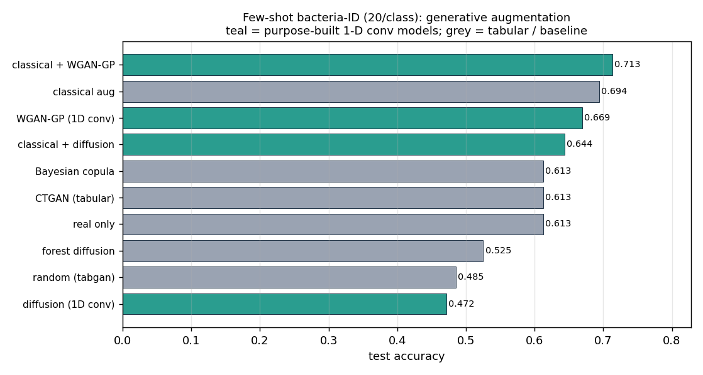

Three honest, partly counter-intuitive findings. **(1) Classical augmentation
alone beats every standalone generator** - physics-informed transforms are the
right tool for few-shot Raman. **(2) The conv WGAN-GP (0.669) beats our conv DDPM
(0.472)**, so "diffusion > GAN" does *not* hold here: a DDPM is data-hungry, its
samples capture the gross spectral shape but smooth away the sharp peaks that
separate isolates (below), which is also why it hurt accuracy. **(3) Stacking the
*good* generator on top of classical helps, the *bad* one hurts**: classical +
WGAN-GP is the overall best (**0.713**, +2 pts over classical alone), while
classical + DDPM (0.644) drags it down. Generic tabular synthesizers either add
noise (random/forest hurt) or have their samples discarded by tabgan's adversarial
filter (CTGAN/copula contributed ~nothing). Lesson: respect the data's structure
(locality, known nuisance transforms) first; layer a generator on top only when it
is good enough to clear the classical baseline.

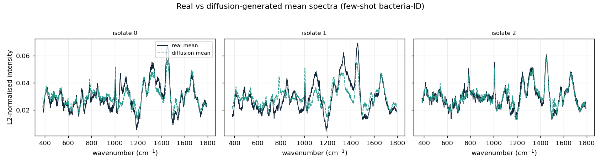

**Was the comparison fair on training budget?** A generator result is only honest
if it is not just an under-training artefact, so `run_generative_epochs_sweep.py`
sweeps epochs (150 -> 1500) for both conv models:

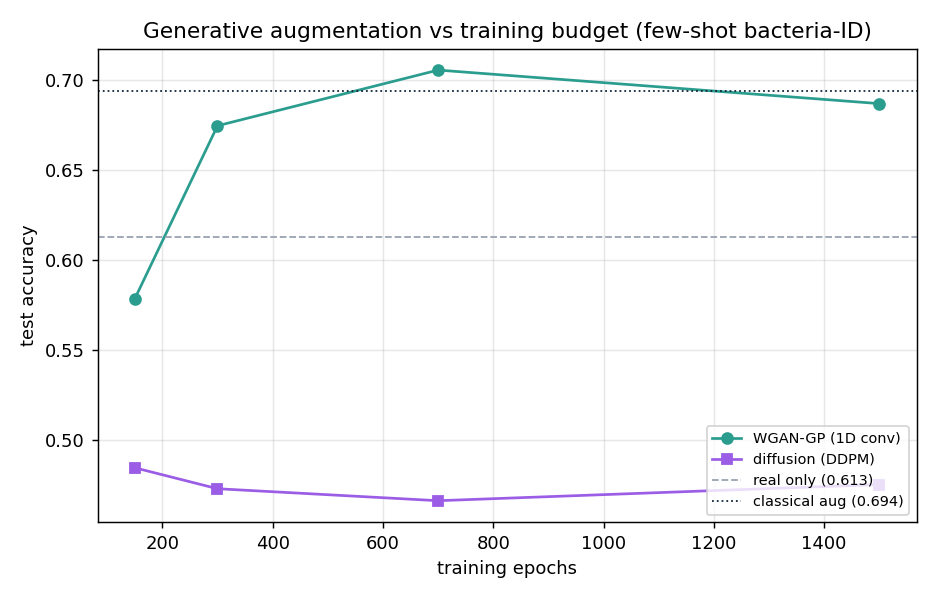

The **DDPM is flat at ~0.47 across the whole range** and its training loss barely
moves (0.55 -> 0.52) - it has *converged*, so more epochs do not rescue it; the
limit is data/capacity on 600 spectra, not budget. The **GAN does benefit from
more training, peaking at 0.706 around 700 epochs** (then mildly over-trains), so
the 300-epoch headline above slightly under-sells it. Crucially, **at every matched
budget the GAN beats the DDPM**, so the ranking is robust to training time.

### Calibration transfer (simulated secondary instrument)
Mean over 25 random splits (n=48 is tiny, so single splits are noisy). A model
trained on the primary instrument degrades on the shifted secondary; **guarded
PDS** (only transfer when it improves a held-out secondary check) recovers it
without the over-correction that sinks unguarded PDS on shift-robust PLSR:

The columns are R² (relative log10 concentration) on the test set under three
conditions: **in-domain** trains and tests on the *primary* instrument (the
ideal, no shift); **secondary (no transfer)** applies that same model to spectra
from the *secondary* instrument as-is - performance drops because the instruments
differ; **secondary (guarded PDS)** first maps the secondary spectra back onto
the primary instrument with Piecewise Direct Standardization (a small banded
transform fit from a few paired standards), applied only when it improves a
held-out check - recovering most of the lost accuracy.

| Model | in-domain | secondary (no transfer) | secondary (guarded PDS) |
|-------|----------:|------------------------:|------------------------:|
| RandomForest | 0.685 | 0.453 | **0.629** |
| SVR-rbf | 0.513 | 0.041 | **0.500** |
| PLSR | 0.579 | 0.366 | **0.463** |


Jackknife+ prediction intervals reach **0.95 coverage** (target 0.90) after the
finite-sample level correction.

### Dimensionality reduction (which embedding separates the classes)
`run_dimreduction.py` scores each 2-D embedding by two measures of how well it
separates the classes (bacteria-ID, 8 isolates), both in [roughly 0, 1], higher =
better: **silhouette** measures cluster geometry - how tight each class cluster is
versus how far apart the clusters sit (1 = well-separated blobs, ~0 = overlapping);
**kNN-acc** is the cross-validated accuracy of a k-nearest-neighbour classifier
*using only the 2-D coordinates* - i.e. can a simple classifier recover the labels
from the embedding alone.

| Method | silhouette | kNN-acc |
|--------|-----------:|--------:|
| **LDA** (supervised) | 0.71 | 0.98 |
| **t-SNE** (best unsupervised) | 0.20 | 0.77 |
| UMAP | 0.09 | 0.69 |
| PCA | 0.05 | 0.68 |
| MDS | 0.02 | 0.55 |

LDA wins outright (it uses labels); among the *unsupervised* methods **t-SNE**
preserves bacterial class structure best. (Caveat: this measures recoverability
of a fixed embedding, not generalisation - LDA's number is an upper bound.)


### Unified pipeline: which combination actually wins
`run_pipeline.py` sweeps the full grid (baseline x normalisation x SG-derivative
x dimensionality-reduction x model, 96 pipelines) with leakage-safe CV and tunes
the winner. Best combination on quantification:

**ALS baseline + L2 norm + Savitzky-Golay 1st-derivative + RandomForest -> R²=0.792**,
**HPO -> 0.808**. The SG derivative appears in nearly every top pipeline - the
single most consistent lever once components are combined.

Each bar in the plot is one pipeline, with the full configuration encoded visually:
- **bar colour - the model**: `RF` (RandomForest), `SVR`, `PLSR`, `kNN`.
- **bar hatch - the baseline-removal method**: `als` (`///`), `arpls` (`xxx`), `snip` (`..`).
- **three dots on the right - the optional steps**, green = applied, grey = off:
  **SNV** (standard-normal-variate normalisation, vs plain L2), **SG-d1**
  (Savitzky-Golay 1st derivative), and **PCA** (reduce to 30 components).

So the top bar is RandomForest, ALS-hatched, with a grey-green-grey dot row =
"L2-normalised (SNV off), 1st-derivative (SG on), no PCA". The SG-d1 dot is green
in nearly every top pipeline - the single most consistent lever once components
are combined.


**Does augmentation push the top pipelines higher?** `run_pipeline_augmented.py`
re-runs the top-5 configs with augmentation added to the *training folds only*
(leakage-safe, same CV). The polystyrene set is 48 mean spectra - far too few to
train a learned GAN/DDPM (they would collapse), so the appropriate generative
augmenter is the dataset's own measurement-noise model: replicates sampled
~ N(mean, measured per-point SD). It lifts the winner from **0.792 to 0.839**
(and past the HPO 0.808):

| Pipeline | no aug | + SD-noise aug |
|----------|-------:|---------------:|
| **RF + ALS + L2 + SG-d1** | 0.792 | **0.839** |
| RF + ALS + SNV + SG-d1 | 0.766 | 0.817 |
| SVR + arPLS + SNV + PCA | 0.757 | 0.688 |
| PLSR + ALS + L2 + SG-d1 + PCA | 0.754 | 0.759 |
| PLSR + ALS + L2 + SG-d1 | 0.746 | 0.711 |

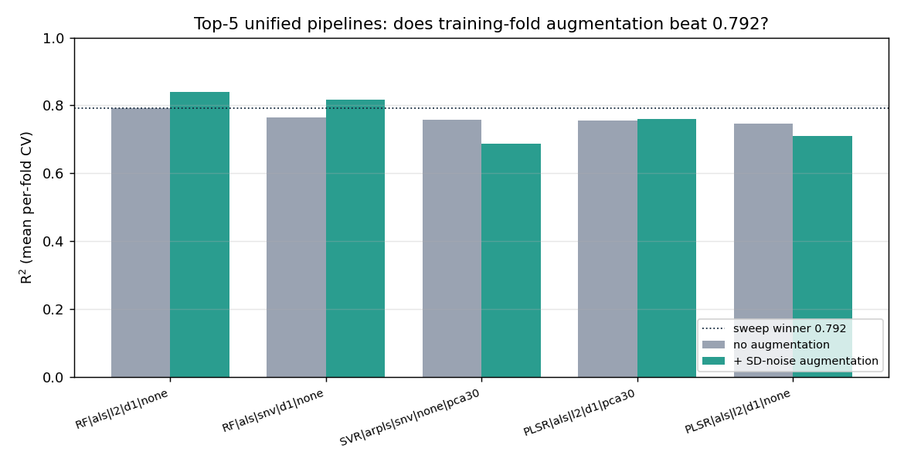

The gain is **model-dependent**: the tree ensembles gain ~+0.05 (extra noisy
replicates regularise them), while SVR and one PLSR config *lose* - more synthetic
spectra are not free. The honest headline: augmenting the best pipeline does beat
the un-augmented sweep, RF reaching **R2 = 0.839**.

### Hyperparameter tuning (detail)
`raman_ml.tuning.tune(estimator, space, X, y, method=...)` wraps any scikit-learn
estimator with three strategies:
- **grid** (`GridSearchCV`) - exhaustive over a small discrete space;
- **random** (`RandomizedSearchCV`) - good default for a few continuous params;
- **bayes** (Optuna TPE) - sample-efficient; ranges given as `(low, high)`,
  log-scaled automatically when they span >= 2 orders of magnitude.

It returns the refit best estimator, best params, and the best CV score. Verified
gains (no-augmentation CV): SVR R² 0.59 -> 0.72, RF 0.62 -> 0.71; and on the
unified pipeline winner, RF 0.792 -> 0.808 (`n_estimators=420, max_depth=22,
max_features=0.11`). Tuning and SD-augmentation are alternative knobs - the main
benchmark uses augmentation (RF 0.848), so they are not stacked.

## How it works

- **Preprocessing** (`src/raman_ml/preprocessing.py`): cosmic-ray/spike removal
  (Whitaker-Hayes), baselines (ALS / arPLS / airPLS / ModPoly / IModPoly / SNIP /
  rubberband), SNV / MSC, Savitzky-Golay derivatives, L2 / min-max norm, resampling.
- **Peak features** (`src/raman_ml/peaks.py`): band-registry peak position / area /
  height / FWHM + area-ratios (interpretable, low-dim features).
- **Dimensionality reduction** (`src/raman_ml/dimensionality_reduction.py`):
  SpectroPCA (+ loadings-as-spectra), t-SNE, UMAP, MDS, Isomap, LDA, with a
  silhouette / kNN separability metric.
- **Models** (`src/raman_ml/models.py`): sklearn baselines + a 1D-CNN and a
  1D-ResNet with on-the-fly augmentation, label smoothing, MC-dropout, and
  C-Mixup (regression).
- **Augmentation** (`src/raman_ml/augment.py`): offset/slope/multiplicative/
  shift/warp/mask/mixup (SpecAugment + Raman-specific).
- **Uncertainty** (`src/raman_ml/uncertainty.py`): split + jackknife+ conformal
  intervals, APS/RAPS conformal sets, temperature scaling, ECE.
- **OOD** (`src/raman_ml/ood.py`): MSP, energy, Mahalanobis + AUROC / FPR@95.
- **Calibration transfer** (`src/raman_ml/calibration_transfer.py`): PDS.
- **Ensembles** (`models.DeepEnsemble`): top-tier UQ + accuracy from M seeds.
- **Interpretability / XAI** (`src/raman_ml/interpretability.py`): Integrated
  Gradients (deep) + **SHAP** (TreeExplainer/LinearExplainer/KernelExplainer)
  peak attribution - which wavenumbers drove a prediction. On bacteria-ID SHAP
  flags 785 / 1006 cm⁻¹ (DNA, phenylalanine); on polystyrene 992-1025 cm⁻¹
  (ring-breathing) - i.e. chemically correct bands.
- **Tuning** (`src/raman_ml/tuning.py`): grid / random / Optuna-Bayesian HPO for
  any sklearn model.
- **Variable selection** (`src/raman_ml/variable_selection.py`): VIP scores +
  leakage-safe `PLSR+VIP` (lifts PLSR R² 0.73 -> 0.85 on raw 48-sample CV; the
  effect washes out under heavy SD-augmentation - see honest-limitations).

All methods are implemented in NumPy / scikit-learn / PyTorch with no extra
dependencies, and are cited to their source papers in the code and in
[`agent-memory/reference/sota-raman-ml.md`](agent-memory/reference/sota-raman-ml.md).

## Repository layout

```
src/raman_ml/   preprocessing · datasets · models · augment · uncertainty · ood ·
                calibration_transfer · interpretability · variable_selection ·
                dimensionality_reduction · tuning · peaks
scripts/        download_data · run_classification · run_quantification ·
                run_domain_shift · run_sota_classification · run_openset ·
                run_calibration_transfer · run_pca_explore · run_dimreduction ·
                run_interpretability · plot_comparison · infographic · folderinfo
benchmarks/     results/ (CSV) · plots/ (PNG) · MODEL_CARDS.md · PLOTS_AND_METRICS.md
data/           downloaded datasets (git-ignored)
agent-memory/   tracked design record; start at agent-memory/MEMORY.md
```

See [`CLAUDE.md`](CLAUDE.md) for operating rules.

## Tests

```bash
pytest -q          # 37 fast unit tests, no downloads / GPU needed
```

## License

Code: **AGPL-3.0-or-later** (see [LICENSE](LICENSE)). Datasets retain their
original licenses and are not redistributed here.

## Selected references

Key works behind the methods (full cited synthesis in
[`agent-memory/reference/sota-raman-ml.md`](agent-memory/reference/sota-raman-ml.md)).

**Raman deep learning & benchmarks**
- Ho et al., *Rapid identification of pathogenic bacteria using Raman spectroscopy and deep learning*, Nat. Commun. 2019 - the bacteria-ID dataset + 26-layer 1D-ResNet (82.2%).
- *Benchmarking Deep Learning Models for Raman Spectroscopy Across Open-Source Datasets*, arXiv:2601.16107 (2026) - SANet 86.1%; documents the val->test distribution-shift gap.
- Lebron et al., *Enhancing Open-World Bacterial Raman Spectra Identification...*, Chem. Biomed. Imaging 2024 - SE-ResNet ensemble 87.8% + open-set rejection.
- Ibtehaz et al., *RamanNet*, Neural Comput. Appl. 2023; SMAE (masked-AE SSL), arXiv:2504.16130 (2025).
- Horgan et al., *High-Throughput Molecular Imaging via Deep-Learning-Enabled Raman Spectroscopy* (DeepeR), Anal. Chem. 2021 - 1D ResUNet denoising + hyperspectral super-resolution; the method-comparison plot style here is inspired by its figures.

**Open-source tooling**
- Georgiev et al., *RamanSPy*, Anal. Chem. 2024; `pybaselines`; BoxSERS; rampy.
- Coca-Lopez, *Data Science for Raman Spectroscopy: a practical example* (B-Phot workshop, 2022) - a clear from-scratch teaching notebook (despiking, ALS/polynomial baseline, SNV, CLS unmixing); confirms our preprocessing suite covers the standard workflow.

**Uncertainty, OOD & transfer**
- Romano et al., *Conformalized Quantile Regression*, NeurIPS 2019; Angelopoulos et al., *RAPS*, ICLR 2021; Barber et al., *jackknife+*, Ann. Stat. 2021.
- Guo et al., *On Calibration of Modern Neural Networks* (temperature scaling), ICML 2017; Lakshminarayanan et al., *Deep Ensembles*, NeurIPS 2017.
- Lee et al., *Mahalanobis OOD*, NeurIPS 2018; Liu et al., *Energy-based OOD Detection*, NeurIPS 2020; Hendrycks & Gimpel, *MSP baseline*, ICLR 2017.
- Bouveresse & Massart, *Piecewise Direct Standardization*, 1996 (calibration transfer).

**Preprocessing, features & augmentation**
- Eilers & Boelens, *ALS baseline* 2005; Baek et al., *arPLS*, Analyst 2015; Zhang et al., *airPLS*, Analyst 2010; Lieber & Mahadevan-Jansen, *ModPoly* 2003; Zhao et al., *IModPoly* 2007; Whitaker & Hayes, *cosmic-ray removal* 2018.
- Chong & Jun, *VIP* 2005; Yao et al., *C-Mixup*, NeurIPS 2022; Park et al., *SpecAugment*, Interspeech 2019.

**Interpretability**
- Sundararajan et al., *Integrated Gradients*, ICML 2017; Lundberg & Lee, *SHAP*, NeurIPS 2017; Selvaraju et al., *Grad-CAM*, ICCV 2017.
